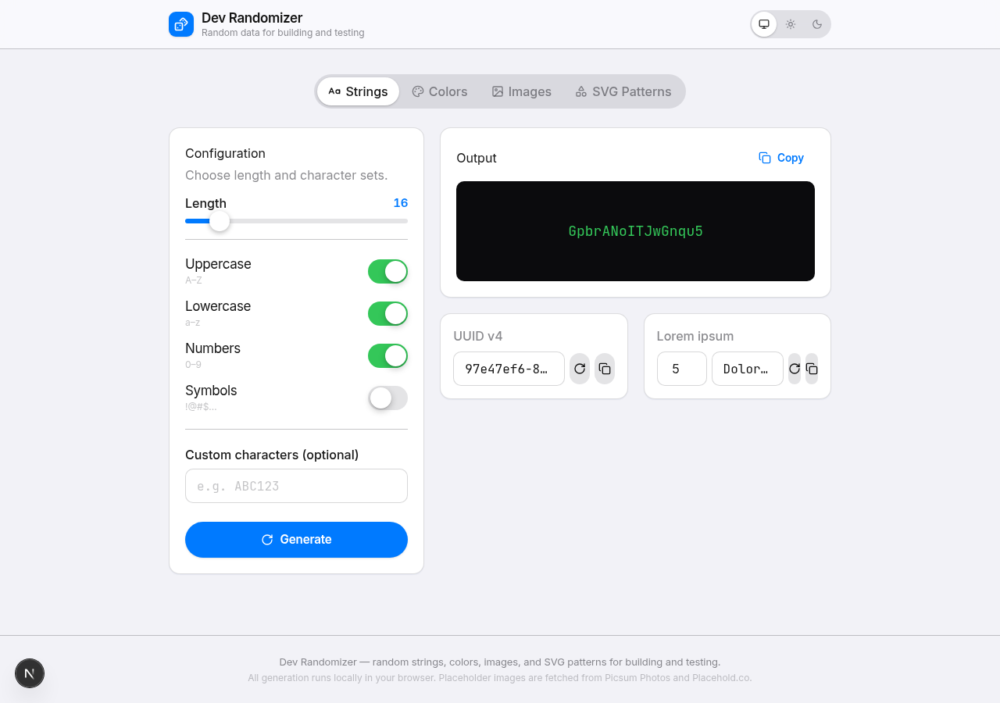
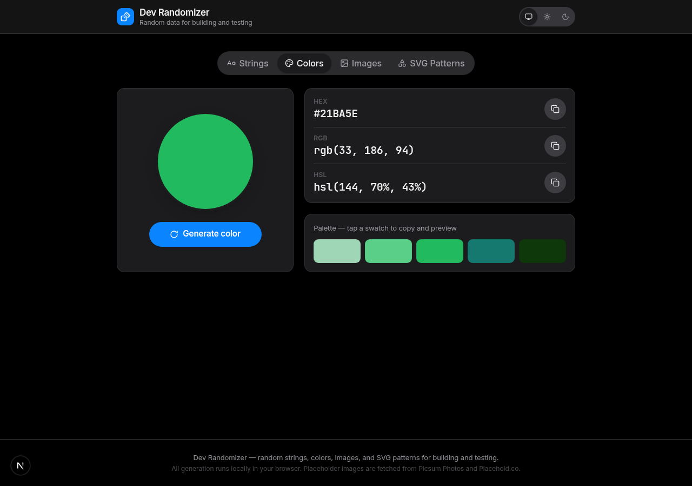
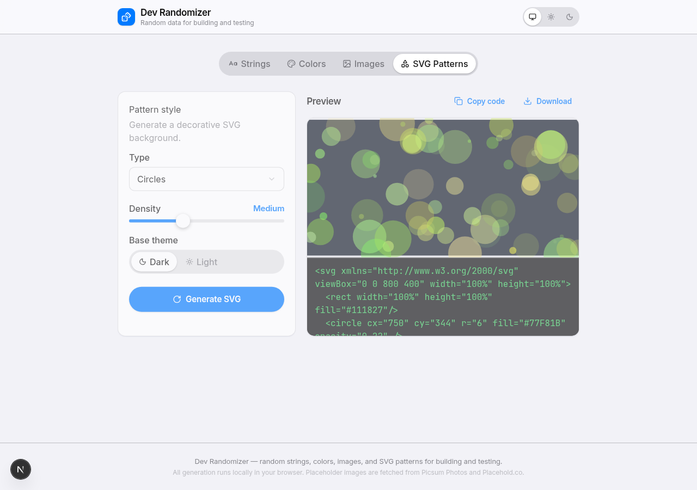

# Dev Randomizer

A small toolbox of random-data generators for building and testing software —
strings, UUIDs, lorem ipsum, colors, placeholder images, and decorative SVG
patterns — built as a Next.js app with an Apple-style ("Human Interface
Guidelines") interface.

<p align="center">
  
  
</p>

## Features

- **Strings** — cryptographically random strings with configurable length and
  character sets (upper/lowercase, numbers, symbols, custom characters), plus
  one-click UUID v4 and lorem ipsum generation.
- **Colors** — a random accent-friendly color with HEX/RGB/HSL values and a
  5-swatch analogous palette; tap any value or swatch to copy it.
- **Images** — builds shareable placeholder-image URLs from
  [Picsum Photos](https://picsum.photos) (random real photos, with grayscale
  and blur options) or [Placehold.co](https://placehold.co) (solid color with
  custom text), with a live preview.
- **SVG Patterns** — generates a self-contained decorative SVG (circles,
  rectangles, lines, triangles, or curved paths) with adjustable density and
  a light/dark base theme; copy the markup or download the file.

All generation runs client-side in the browser — nothing is sent to a server
except the two placeholder-image services, which only receive the width,
height, and options you choose.

## Design

The interface follows Apple's Human Interface Guidelines: the system type
ramp, semantic light/dark colors, translucent "material" bars, capsule
buttons and segmented controls, hairline separators, and spring-based motion
(including a shared-element "magic motion" indicator on the segmented
controls) rather than ease-curve transitions. It respects
`prefers-reduced-motion`, `prefers-reduced-transparency`, and
`prefers-contrast`, and ships a System/Light/Dark theme switcher.

<p align="center">
  
</p>

## Tech stack

- [Next.js 16](https://nextjs.org) (App Router, Turbopack, React 19)
- [TypeScript](https://www.typescriptlang.org)
- [Tailwind CSS v4](https://tailwindcss.com)
- Hand-built [shadcn/ui](https://ui.shadcn.com)-style primitives on top of
  [Radix UI](https://www.radix-ui.com) (Select, Slider, Switch, Tooltip,
  Separator, Label)
- [Framer Motion](https://motion.dev) for the spring-animated segmented
  control indicator and panel transitions
- [next-themes](https://github.com/pacocoursey/next-themes) for the
  System/Light/Dark theme switcher
- [Sonner](https://sonner.emilkowal.ski) for toast notifications
- [Lucide](https://lucide.dev) icons

## Getting started

Requires Node.js 20.9 or later.

```bash
npm install
npm run dev
```

Open [http://localhost:3000](http://localhost:3000).

### Scripts

| Command         | Description                   |
| ---------------- | ------------------------------ |
| `npm run dev`     | Start the development server   |
| `npm run build`   | Build for production           |
| `npm run start`   | Serve the production build     |
| `npm run lint`    | Run ESLint                     |

## Project structure

```
src/
  app/                    Next.js App Router entry (layout, page, global styles)
  components/
    ui/                    Hand-built shadcn/ui-style primitives (button, card, select, ...)
    generators/            The four tool panels (string, color, image, svg)
    segmented-control.tsx   Apple-style segmented control with a spring-animated indicator
    site-header.tsx         Sticky translucent header
    theme-toggle.tsx        System/Light/Dark switcher
  hooks/
    use-clipboard.ts        Clipboard copy with toast feedback
  lib/
    generators.ts           Pure, framework-free generator logic (unit-testable)
    utils.ts                 Tailwind class-merging helper
```

The generator logic in `src/lib/generators.ts` has no dependency on React or
the DOM (aside from `crypto`), so it can be imported and tested in isolation.

## License

Released under the [MIT License](LICENSE).
